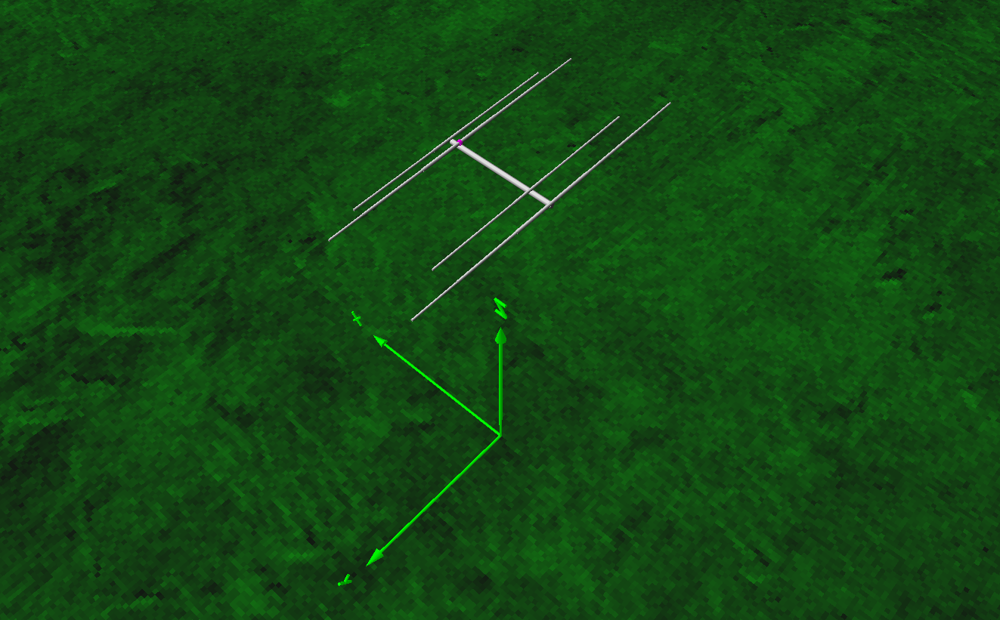
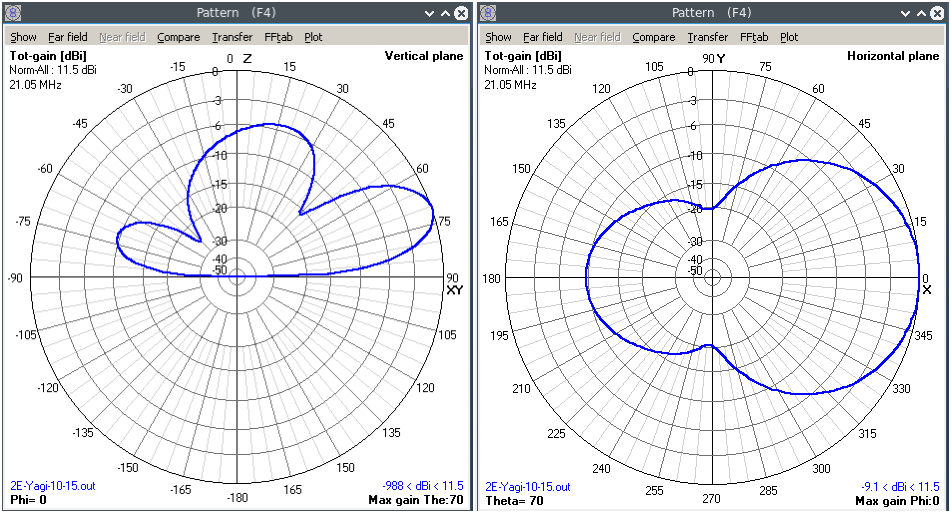
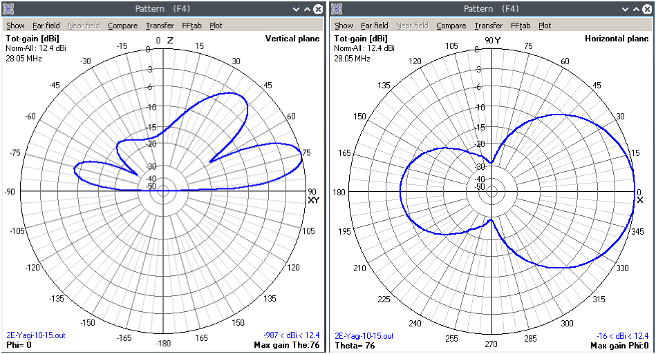

# 10/15m Band Portable Yagi Antenna
Dualband portable 2 elements yagi antenna  for 10m and 15m CW.
The idea behind it is simple; We construct a 2-elements Yagi antenna for 15m band, then add 10m band 2 elements yagi into it so the driven element for the 10m band is open-sleeve-coupled from the 15m band driven element. This method of feeding will results of an easy-to-construct-and-feed dualband yagi antenna at the expense of narrower bandwidth at the higher band.
This problem of narrower bandwidth is not a problem since the usage at 10m band is intended for CW portion only.

## Simulation Results (15m Band)

## Simulation Results (10m Band)

## Contributing
1. Fork it [https://github.com/handiko/Portable-Yagi-10-15-2E/fork](https://github.com/handiko/Portable-Yagi-10-15-2E/fork)
2. Create new branch (`git checkout -b myfeature`)
3. Do some editing / create new feature
4. Commit your works (`git commit -m "Adding some myfeature blah blah.."`)
5. Push to the branch (`git push -u origin myfeature`)
6. Create a new Pull Request
